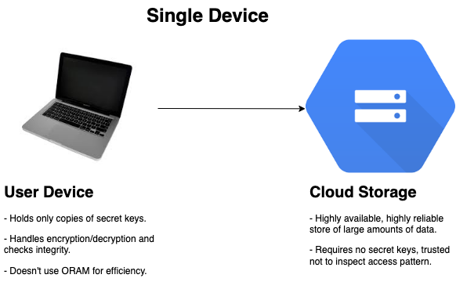
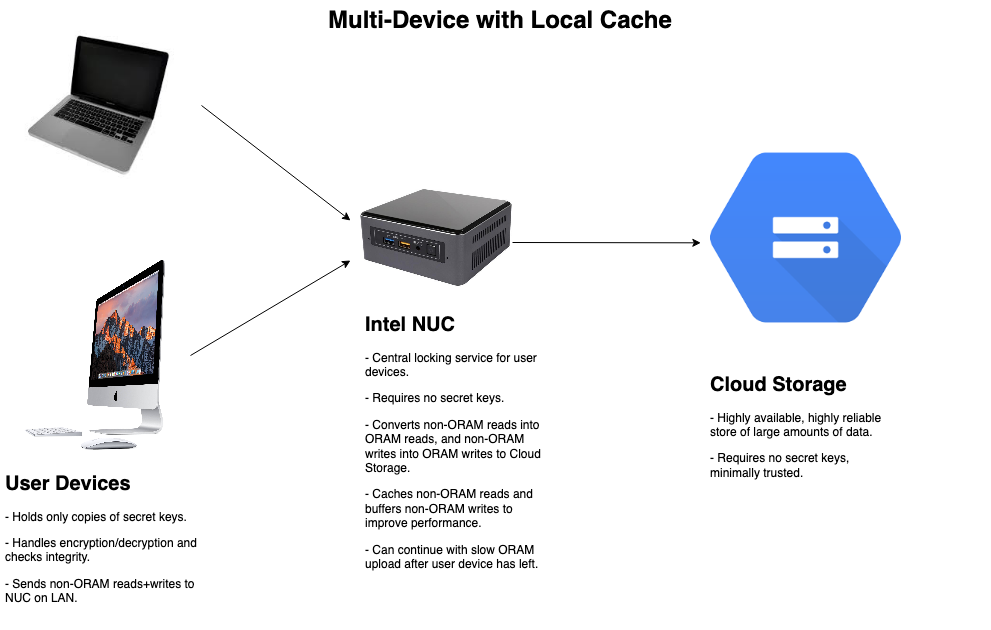

Functional Specification: Encrypted Storage Solution
----------------------------------------------------

## Summary

This document describes the implementation of a cloud storage solution for
personal use, with strong cryptographic protection of the user's content.

While high-quality full-disk encryption is extremely widely deployed, cloud
storage is almost never end-to-end encrypted and out of the solutions I'm aware
of, all of them have at least one of these drawbacks:

- They're not open-source or have a published protocol.
- Viewing part of a large file, or partially modifying a large file requires
  downloading, decrypting, re-encrypting, re-uploading the entire file because
  it's encrypted in the naive way.
- The directory structure is not authenticated, so files can be omitted or
  re-arranged by the cloud provider without detection.
- The access pattern, individual file size, directory structure, and possibly
  even file name are leaked to the cloud provider.

However it's possible to build a solution that can authenticate all of the above
and severely limit leakage with standard cryptographic techniques, i.e. an AEAD
and a hash function. With a pretty substantial loss in efficiency, you can also
hide the access pattern while still being usable for simpler things like text
editing.

## Requirements & Assumptions

- Be open-source with a documented protocol.
- Use a cloud storage provider. Integrations should be provided for:
  - A custom server which may be deployed on-premise.
  - A standard storage provider – either Google Cloud Storage or AWS S3, whichever works better.
  - A budget storage provider – either B2 or Wasabi, whichever works better.
- Data should be stored in fixed-size blocks connected into a linked list, as
  described [here](https://blog.bren2010.io/2015/04/07/data-structures.html#1-linked-lists).
  A skiplist should be used to allow efficient seeking.
- Data should be authenticated with a Merkle tree.
- There should be a FUSE binding that allows easy modification of the user's
  data.
- There should be an ORAM implementation which may be optionally enabled.
- There should be multi-user support which may be optionally enabled.

## System Design

The codebase will be constructed around the following layers:

- **Object Storage Layer.** Implements getters and setters for fixed-size byte
  slices, which are backed by a cloud storage provider.
- **App Storage Layer.** Makes reliable modifications to the **Object Storage
  Layer** possible by implementing atomic transactions and, if there are
  multiple clients, distributed locking.
  - **Integrity Layer.** Prevents a cloud provider from modifying or omitting
    blocks by maintaining a Merkle tree over them. Tree heads are assigned a
    sequence number, and we keep a local copy of the sequence number to prevent
    rollbacks.
  - **Encryption Layer.** Hides the contents of objects from the cloud provider
    by encrypting them.
  - **ORAM Layer.** Hides the data access pattern from all layers below through
    the use of an ORAM protocol.
- **Block Layer.** Implements arbitrary-length streams of data as a skiplist
  over fixed-size objects provided by the **App Storage Layer**. It allows
  efficient seeking through large streams and in-place modification.
- **iNode Layer.** Implements filesystem-like inodes over the **Block Layer**,
  containing the metadata of files and pointing to their contents.
- **FUSE Binding.** Bridges the gap between the **iNode Layer** and the user's
  operating system, allowing files to be viewed and modified as if they were
  on-disk.

The code will be modular enough to support many different setups. A **Single
Device** setup is the simplest, but may not be efficient enough for ORAM. A
**Multi-Device Setup** is more complex, possibly requiring trusted hardware, but
will support many devices and be efficient enough for ORAM.

## Additional Documentation

 - Path ORAM: https://eprint.iacr.org/2013/280.pdf
